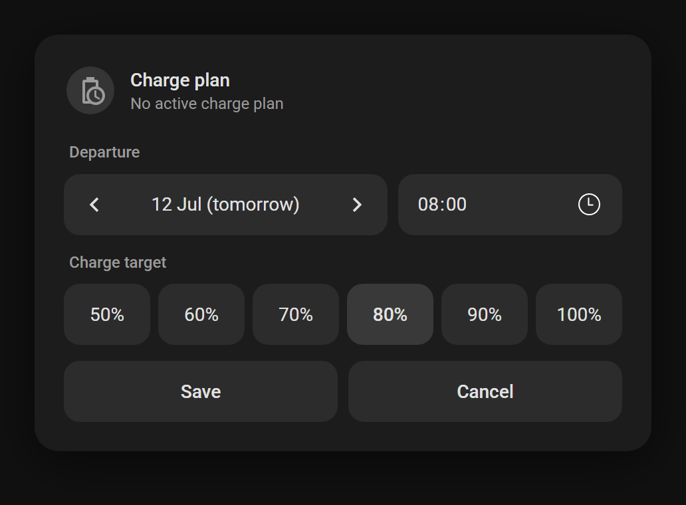

# EVCC Plan Card

A minimal, Home Assistant-native Lovelace card to set an **EVCC departure charge plan** (departure time + target state of charge). Designed as a lightweight companion to the [marq24/ha-evcc](https://github.com/marq24/ha-evcc) integration — without the complexity of a full EVCC dashboard card.

Built to feel like a native Home Assistant tile card: same typography, control styling, hover states, and theme-aware colors. Works great inside a [browser_mod](https://github.com/thomasloven/hass-browser_mod) popup, on desktop, iPhone, and iPad.



## Features

- 📅 **Day stepper** — quickly pick today, tomorrow, or up to 6 days ahead
- 🕐 **Native time picker** — 15-minute steps (configurable)
- 🔋 **Charge target pills** — one-tap SoC selection (50–100%, configurable)
- 🟡 **Plan status header** — shows the active plan (time → SoC) and highlights the icon, just like a tile card
- 💾 **Save / Cancel / Delete** — writes the plan via `evcc_intg.set_vehicle_plan`, deletes via `evcc_intg.del_vehicle_plan`
- 🪟 **Popup-aware** — Save/Cancel/Delete automatically close a browser_mod popup
- 🌐 **English + Dutch** — auto-detected from your Home Assistant language, or forced via config
- 🎨 **Theme-aware** — all colors derive from your active theme; no hardcoded styling

## Requirements

- [ha-evcc (`evcc_intg`)](https://github.com/marq24/ha-evcc) — the EVCC integration that provides the entities and the `set_vehicle_plan` / `del_vehicle_plan` services
- A vehicle configured in EVCC that supports SoC-based plans
- Optional: [browser_mod](https://github.com/thomasloven/hass-browser_mod) if you want to open the card as a popup

## Installation

### HACS (recommended)

1. In HACS, click the three-dot menu → **Custom repositories**
2. Add `https://github.com/tieskuh/evcc-plan-card` with category **Dashboard**
3. Search for **EVCC Plan Card** and install it
4. Reload your browser (HACS registers the resource automatically)

### Manual

1. Download `evcc-plan-card.js` from the [latest release](https://github.com/tieskuh/evcc-plan-card/releases)
2. Copy it to `config/www/evcc-plan-card.js`
3. Add it as a dashboard resource: **Settings → Dashboards → ⋮ → Resources** → `/local/evcc-plan-card.js` (JavaScript module)

## Usage

### Minimal

```yaml
type: custom:evcc-plan-card
loadpoint: carport
```

The `loadpoint` is the slug of your EVCC loadpoint as it appears in your `evcc_intg` entity IDs (e.g. `select.evcc_carport_vehicle_name` → loadpoint is `carport`). All entity IDs are derived from it automatically.

### As a browser_mod popup

Open the card from any button, for example from a tile card feature:

```yaml
tap_action:
  action: fire-dom-event
  browser_mod:
    service: browser_mod.popup
    data:
      dismissable: true
      style: |
        --popup-min-width: 420px;
        --popup-max-width: 460px;
        ha-dialog {
          --dialog-surface-margin-top: auto;
          --ha-dialog-scrim-backdrop-filter: blur(8px);
          --mdc-dialog-scrim-color: rgba(0,0,0,0.4);
          --ha-dialog-border-radius: 18px;
        }
      content:
        type: custom:evcc-plan-card
        loadpoint: carport
```

The Save, Cancel, and Delete buttons close the popup automatically.

## Configuration options

| Option | Type | Default | Description |
|---|---|---|---|
| `loadpoint` | string | `carport` | EVCC loadpoint slug; used to derive all entity IDs below |
| `vehicle_select` | entity | `select.evcc_<loadpoint>_vehicle_name` | The ha-evcc vehicle select; the vehicle ID for the plan service is read from its attributes |
| `plan_active` | entity | `binary_sensor.evcc_<loadpoint>_plan_active` | Binary sensor indicating an active plan |
| `plan_time` | entity | `sensor.evcc_<loadpoint>_effective_plan_time` | Timestamp sensor with the plan departure time |
| `plan_soc` | entity | `sensor.evcc_<loadpoint>_effective_plan_soc` | Sensor with the plan target SoC |
| `soc_options` | list | `[50, 60, 70, 80, 90, 100]` | Charge target percentages shown as pills |
| `minute_step` | number | `15` | Time picker granularity in minutes |
| `default_day_offset` | number | `1` | Default day when no plan is active (`0` = today, `1` = tomorrow) |
| `default_hour` | number | `8` | Default hour when no plan is active |
| `default_soc` | number | `80` | Default charge target when no plan is active |
| `max_days` | number | `6` | How many days ahead can be selected |
| `language` | string | auto | Force a language (`en` or `nl`); defaults to your HA language |
| `title` | string | auto | Override the card title |

When a plan is active, the card pre-fills with the plan's day, time, and target instead of the defaults, and shows a **Delete plan** button.

## How it works

The card calls the `evcc_intg` services directly — no helpers, scripts, or automations needed:

- **Save** → `evcc_intg.set_vehicle_plan` with `vehicle`, `soc`, and `startdate`
- **Delete** → `evcc_intg.del_vehicle_plan` with `vehicle`

The vehicle ID is resolved live from the loadpoint's vehicle select entity, so it follows whatever vehicle is currently assigned to the loadpoint.

## Credits

- [marq24/ha-evcc](https://github.com/marq24/ha-evcc) for the excellent EVCC integration
- [evcc](https://evcc.io/) for the EV charging brains
